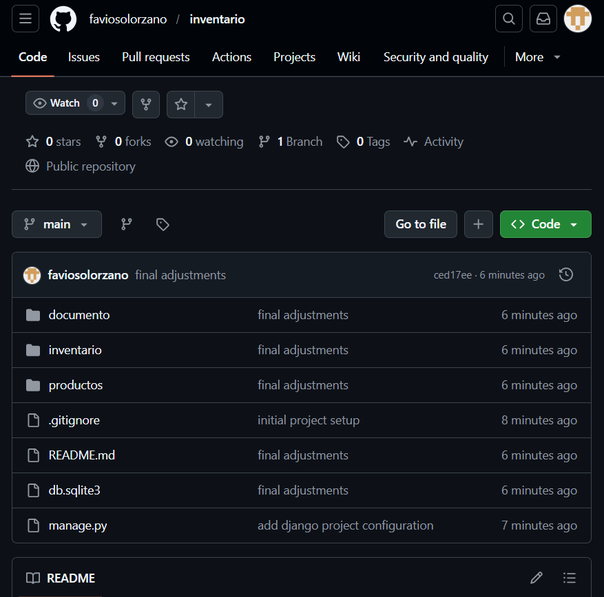
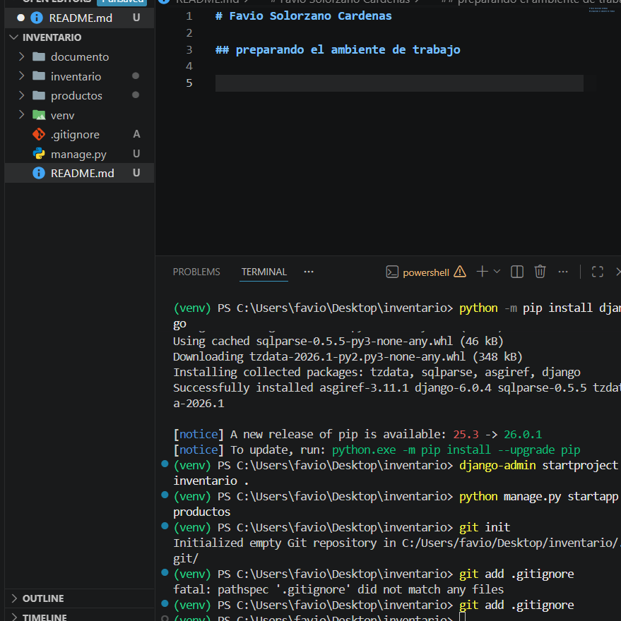
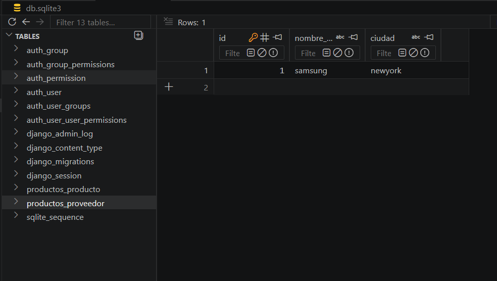
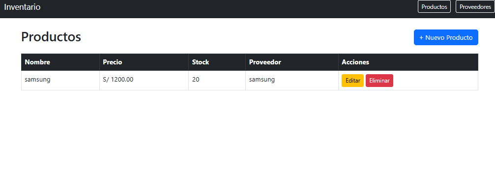
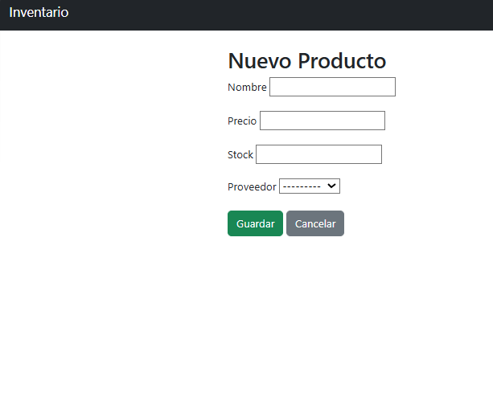
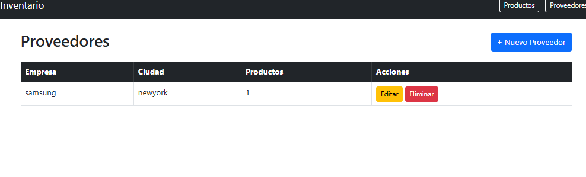

# Favio Solorzano Cardenas

## 📖 Descripción del Proyecto

Aplicación web desarrollada en Django para gestionar el inventario de productos y sus proveedores. Permite realizar operaciones CRUD (Crear, Leer, Actualizar, Eliminar) sobre ambas entidades, manteniendo la relación entre productos y proveedores.

## 🛠️ Tecnologías Utilizadas

- Python 3.14
- Django 6.0
- SQLite3
- Bootstrap 5
- HTML5

## ⚙️ Pasos para Instalación y Ejecución

### 1. Clonar el repositorio
```bash
git clone https://github.com/TU_USUARIO/inventario.git
cd inventario
```

### 2. Crear y activar el entorno virtual
```bash
python -m venv venv
venv\Scripts\activate
```

### 3. Instalar dependencias
```bash
pip install django
```

### 4. Aplicar migraciones
```bash
python manage.py migrate
```

### 5. Levantar el servidor
```bash
python manage.py runserver
```

### 6. Abrir en el navegador

http://127.0.0.1:8000/

## 🖼️ Capturas de Pantalla

## Creación del repositorio



## Preparación del ambiente


## Migraciones y base de datos




## Lista de Productos



## Formulario de Producto



## Lista de Proveedores



## 🙌 Autor

**Favio Solorzano Cardenas**